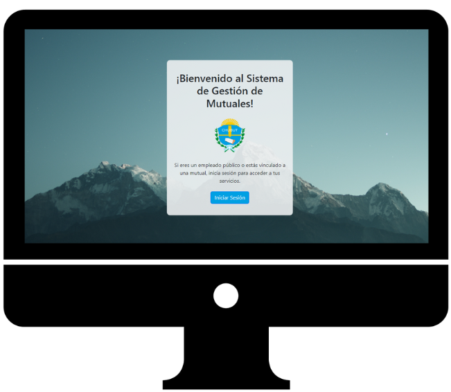

# 💻 Sistema Gestión de Mutuales 💻 

## Índice
1. [Introducción](#introducción)
2. [Autores](#autores)
3. [Elementos Utilizados](#elementos-utilizados)
4. [Instalación](#instalación)
5. [Ejecutar mi Proyecto Django en Docker](#ejecutar-mi-proyecto-django-en-docker)
6. [Documentación y Guías](#documentación-y-guías)

## Introducción

📝 El proyecto tiene como objetivo migrar código de Java a Python. Este proyecto surge de la necesidad de aprovechar las ventajas y la popularidad del lenguaje de programación Python, así como la demanda de convertir un sistema existente escrito en Java.

<div align="center"> 
  
</div>

## Autores
- [Arcos Vargas Martín](www.linkedin.com/in/martin-arcos)
- [Lucero Carlos](https://www.linkedin.com/in/lucerocarlos/)


## Elementos Utilizados
- Python 3.10.7
- Django versión 5.0.1


## Instalación

1. Clonar el repositorio:
```bash
git clone https://github.com/cozakoo/MutualesWeb_DjangoPython.git
```

2. Crear el entorno virtual:
```bash
python -m venv <venv>
```

3. Activar el entorno virtual:
```bash
# Para sistemas POSIX (Linux, macOS, etc.) con bash/zsh:
$ source <venv>/bin/activate

# Para sistemas POSIX con fish:
$ source <venv>/bin/activate.fish

# Para sistemas POSIX con csh/tcsh:
$ source <venv>/bin/activate.csh

# Para sistemas POSIX con PowerShell Core:
$ <venv>/bin/Activate.ps1

# Para Windows con cmd.exe:
C:\> <venv>\Scripts\activate.bat

# Para Windows con PowerShell:
PS C:\> <venv>\Scripts\Activate.ps1
```

3. Instalar las dependencias:

```bash
cd MutualesWeb_DjangoPython/
cd source/
pip install -r requirements.txt
```
3. Instalar las dependencias:
```bash
python manage.py runserver
```

## Ejecutar mi Proyecto Django en Docker
Este repositorio contiene un proyecto Django que puede ejecutarse en un contenedor Docker. Sigue las instrucciones a continuación para construir la imagen Docker y ejecutar el contenedor.


### Requisitos
Antes de comenzar, asegúrate de tener instalado Docker en tu sistema.

### Instrucciones
1. **Clonar el Repositorio:** Clona este repositorio en tu máquina local:
   ```bash
   git clone https://github.com/cozakoo/MutualesWeb_DjangoPython.git
   ```
2. **Construir la Imagen Docker:** Ve al directorio raíz del proyecto y ejecuta el siguiente comando para construir la imagen Docker:
   ```bash
   git clone docker build -t nombre-de-tu-imagen .
   ```
3. **Ejecutar el Contenedo:**  Una vez que se haya construido la imagen Docker, ejecuta el siguiente comando para iniciar el contenedor:
   ```bash
   docker run -p 8000:8000 -d nombre-de-tu-imagen
   ```
4. **Acceder a la Aplicación:** Abre tu navegador web y navega a http://localhost:8000 para acceder a tu aplicación Django.

5. **Detener el Contenedor (Opcional):** Si deseas detener el contenedor en algún momento, puedes ejecutar el siguiente comando:
   ```bash
   docker stop nombre-o-id-del-contenedor
   ```


## Documentación y Guías
- 📖 [Link de acceso](https://drive.google.com/drive/folders/1Jvz5RIItJmNVQSpdEZ8e01b3On_3ktvf?usp=sharing)


